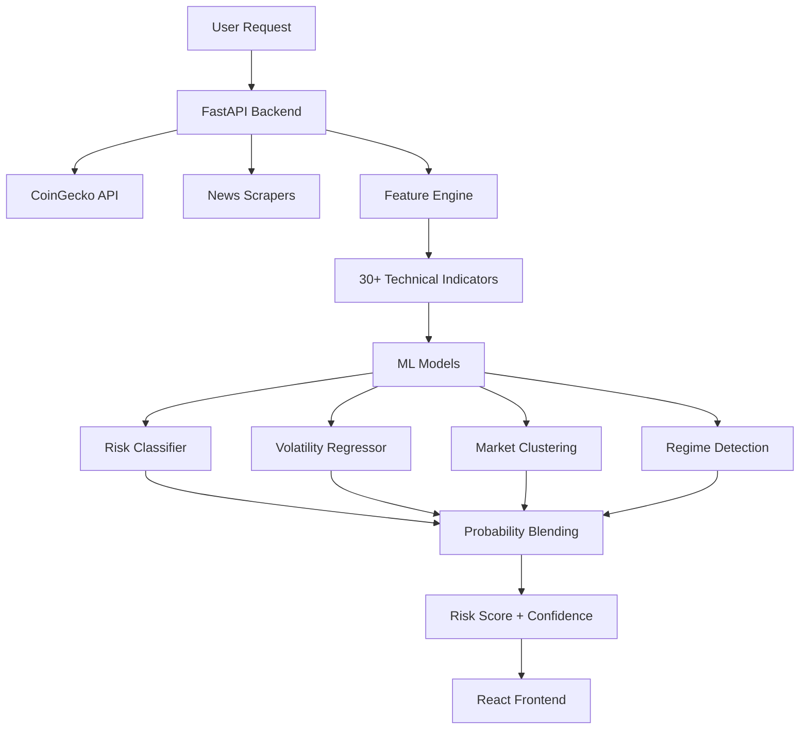

<h1 align="center">
  
</h1>

<p align="center">
  
  
  
  
  
</p>

<p align="center">
  <strong>Real-time cryptocurrency risk assessment platform powered by machine learning</strong><br>
  Analyzes live market data, news sentiment, and technical indicators to provide actionable risk scores
</p>

<p align="center">
  <a href="#-features">Features</a> •
  <a href="#-quick-start">Quick Start</a> •
  <a href="#-architecture">Architecture</a> •
  <a href="#-api">API</a> •
  <a href="#-tech-stack">Tech Stack</a>
</p>

---

## ✨ Features

<table>
<tr>
<td width="50%">

### 🎯 Risk Assessment
- **Multi-Model Ensemble**: Random Forest + XGBoost + HMM
- **Real-time Analysis**: Live OHLCV data from CoinGecko
- **Confidence Scoring**: Uncertainty quantification
- **Regime Detection**: Market state identification

</td>
<td width="50%">

### 📊 Technical Analysis
- **30+ Indicators**: RSI, MACD, Bollinger, ATR, etc.
- **Volatility Forecasting**: 7-day predictions with CI
- **Market Clustering**: Behavioral pattern grouping
- **Drawdown Metrics**: Risk exposure tracking

</td>
</tr>
<tr>
<td width="50%">

### 🧠 Sentiment Analysis
- **Multi-Source Scraping**: RSS, Reddit, Google News
- **LLM Processing**: AI-powered sentiment scoring
- **Fear & Greed Index**: Market emotion tracking
- **Google Trends**: Search volume correlation

</td>
<td width="50%">

### 🎨 Modern UI
- **Interactive Dashboard**: Real-time visualizations
- **3D Globe**: Global market overview
- **Responsive Design**: Mobile-first approach
- **Smooth Animations**: Motion-powered transitions

</td>
</tr>
</table>

---

## 🚀 Quick Start

### Prerequisites

```bash
Python 3.10+  |  Node.js 18+  |  npm/yarn
```

### Backend Setup

```bash
# Clone the repository
git clone https://github.com/adityajkate/crypto-risk.git
cd crypto-risk

# Install Python dependencies
pip install -r requirements.txt

# Configure environment variables
cp .env.example .env
# Add your API keys to .env

# Train ML models (first time only)
cd ml/scripts
python run_all.py

# Start the API server
cd ../..
python run_api.py
```

🌐 **API Server**: http://localhost:8000

### Frontend Setup

```bash
# Navigate to frontend directory
cd frontend

# Install dependencies
npm install

# Start development server
npm run dev
```

🎨 **UI Dashboard**: http://localhost:3000

---

## 🏗️ Architecture



### Data Flow

```
📥 Live Data → 🔧 Feature Engineering → 🤖 ML Inference → 📊 Risk Score → 🎨 Visualization
```

---

## 📁 Project Structure

```
crypto-risk/
│
├── 🔧 backend/              # FastAPI application
│   ├── api/                 # API endpoints & clients
│   ├── scrapers/            # News & social media scrapers
│   ├── services/            # LLM & business logic
│   └── workers/             # Background processing
│
├── 🧠 ml/                   # Machine learning pipeline
│   ├── scripts/             # Training & preprocessing
│   └── data/                # Training datasets
│
├── ⚙️ core/                 # Shared utilities
│   ├── feature_engine.py    # Technical indicators
│   ├── coingecko_client.py  # API client
│   └── models.py            # Data models
│
├── 🎨 frontend/             # React + TypeScript UI
│   └── src/
│       ├── pages/           # Route components
│       ├── components/      # Reusable UI components
│       └── services/        # API integration
│
└── 💾 models/               # Trained model artifacts
```

---

## 🔌 API Endpoints

| Method | Endpoint | Description |
|--------|----------|-------------|
| `GET` | `/api/v1/coin/{id}/analysis` | Full risk analysis (risk + volatility + cluster + regime) |
| `GET` | `/api/v1/coin/{id}/risk` | Risk assessment only |
| `GET` | `/api/v1/coin/{id}/price` | Current price & market data |
| `GET` | `/api/v1/batch/analysis` | Batch analysis (up to 10 coins) |
| `GET` | `/api/v1/sentiment/{currency}` | Sentiment analysis for coin |
| `GET` | `/api/v1/trending` | Trending coins from CoinGecko |
| `GET` | `/api/v1/global` | Global market metrics |
| `GET` | `/health` | Health check |

### Example Response

```json
{
  "risk_assessment": {
    "risk_label": "high",
    "probabilities": {
      "low": 0.04,
      "medium": 0.19,
      "high": 0.77
    },
    "confidence": 0.77,
    "is_uncertain": false,
    "regime_adjustment": "high_vol_crisis"
  },
  "volatility_forecast": {
    "predicted_volatility_7d": 0.028,
    "confidence_intervals": {
      "lower_10": 0.012,
      "median_50": 0.025,
      "upper_90": 0.051
    }
  },
  "market_cluster": { "cluster": 2 },
  "market_regime": { "regime_name": "high_vol_crisis" }
}
```

---

## 🛠️ Tech Stack

### Backend
- **Framework**: FastAPI 0.104, Uvicorn
- **ML**: scikit-learn, XGBoost, hmmlearn, statsmodels
- **Analysis**: TA-Lib (30+ technical indicators)
- **NLP**: Transformers, PyTorch, Sentence-Transformers
- **Data**: pandas, numpy, httpx, aiohttp

### Frontend
- **Framework**: React 19.2, TypeScript 5.8
- **Build**: Vite 6.2
- **3D Graphics**: Three.js, React Three Fiber
- **Charts**: Recharts, D3.js
- **Animation**: Motion (Framer Motion)
- **UI**: Lucide Icons, Rough Notation

### Data Sources
- **Market Data**: CoinGecko API
- **Sentiment**: RSS feeds, Reddit API, Google News
- **Trends**: Google Trends (pytrends)
- **Metrics**: Fear & Greed Index

---

## 🔑 Environment Variables

Create a `.env` file in the root directory:

```bash
# CoinGecko API
COINGECKO_API_KEY=your_coingecko_key

# OpenAI (for LLM sentiment analysis)
OPENAI_API_KEY=your_openai_key

# Reddit API (optional)
REDDIT_CLIENT_ID=your_reddit_id
REDDIT_CLIENT_SECRET=your_reddit_secret
```

---

## 🤖 ML Models

### 1. Risk Classifier
- **Algorithm**: Random Forest (500 trees, depth 20)
- **Output**: Low / Medium / High risk with probabilities
- **Features**: 30+ technical indicators

### 2. Volatility Forecaster
- **Algorithm**: Quantile Regression
- **Output**: 7-day forward volatility with confidence intervals
- **Quantiles**: 10th, 50th, 90th percentiles

### 3. Market Clustering
- **Algorithm**: K-Means
- **Output**: Behavioral pattern groups
- **Features**: 7 key market indicators

### 4. Regime Detection
- **Algorithm**: Gaussian Hidden Markov Model
- **Output**: Market state (stable/transition/crisis)
- **Features**: Log returns + volatility

---

## 📊 Technical Indicators

<details>
<summary><strong>View All Indicators (30+)</strong></summary>

### Trend Indicators
- RSI (Relative Strength Index)
- MACD (Moving Average Convergence Divergence)
- ADX (Average Directional Index)
- CCI (Commodity Channel Index)
- Aroon Oscillator

### Volatility Indicators
- Bollinger Bands (Upper, Middle, Lower)
- ATR (Average True Range)
- Standard Deviation
- Historical Volatility

### Volume Indicators
- OBV (On-Balance Volume)
- MFI (Money Flow Index)
- Volume Ratio
- VWAP (Volume Weighted Average Price)

### Momentum Indicators
- Stochastic RSI
- Williams %R
- ROC (Rate of Change)
- Momentum Oscillator

### Risk Metrics
- Maximum Drawdown
- Recovery Ratio
- Drawdown Duration
- Sharpe Ratio

</details>

---

## 🧪 Training Pipeline

```bash
# Full training pipeline
cd ml/scripts
python run_all.py

# Individual steps
python collect_training_data.py  # Fetch historical data
python preprocess.py             # Feature engineering
python label_generator.py        # Generate risk labels
python train_risk_classifier.py  # Train risk model
python train_regression.py       # Train volatility model
python train_clustering.py       # Train clustering model
python train_regime_model.py     # Train regime detector
```

---

## 📈 Workflow

1. **Data Collection**: Fetch top 50 coins from CoinGecko
2. **Preprocessing**: Convert to OHLCV format + feature engineering
3. **Label Generation**: Assign risk labels based on thresholds
4. **Model Training**: Train ensemble of ML models
5. **API Inference**: Real-time predictions via FastAPI
6. **Background Workers**: Sentiment analysis + clustering updates
7. **Frontend Display**: Interactive visualizations

---

## 🤝 Contributing

Contributions are welcome! Please feel free to submit a Pull Request.

---

## 📄 License

This project is licensed under the MIT License.

---

<p align="center">
  <strong>Built with ❤️ by <a href="https://github.com/adityajkate">Aditya Kate</a></strong>
</p>

<p align="center">
  <a href="https://github.com/adityajkate/crypto-risk/stargazers">⭐ Star this repo</a> •
  <a href="https://github.com/adityajkate/crypto-risk/issues">🐛 Report Bug</a> •
  <a href="https://github.com/adityajkate/crypto-risk/issues">💡 Request Feature</a>
</p>
